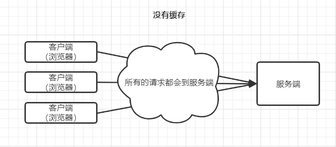
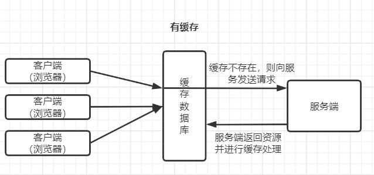
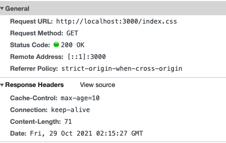
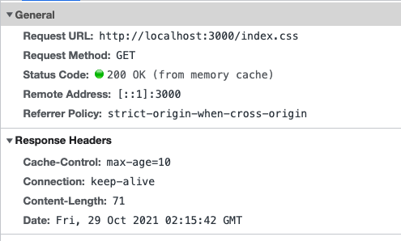
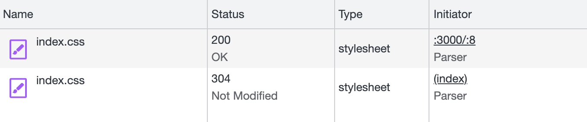
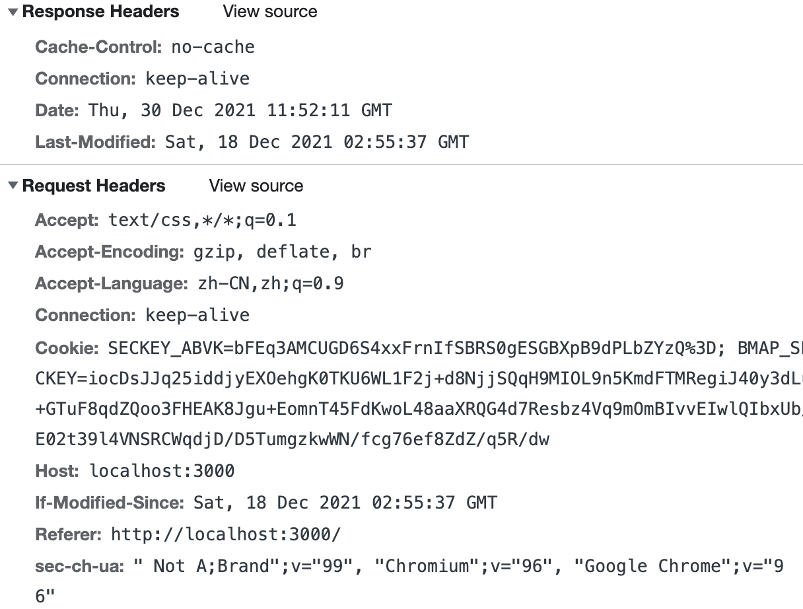

# 基本概念
通过复用以前获取的资源，可以显著提高网站和应用程序的性能。Web 缓存减少了等待时间和网络流量，因此减少了显示资源表示形式所需的时间。通过使用 HTTP缓存，有效提高页面响应速度，或有效增强响应性。

根据下述两张图，可以看出有缓存和没有缓存的区别。



# 实现http请求强制缓存&协商缓存

首先我们先看下请求静态资源的请求头信息，每次页面刷新都会向服务端发送请求。


```js
let server = http.createServer(async (req, res) => {
  console.log('=====', req.url) // /index.css 每次刷新都会进行打印
  //...
})
```
> 对一些实时性不高的静态文件进行缓存，防止重复请求服务器，造成服务器压力、渲染页面变慢等问题。


## 强制缓存&协商缓存

- 强制缓存：用户发送的请求，直接从用户客户端缓存读取，不发送到服务端，无需与服务端交互
- 协商缓存：用户发送的请求，发送到服务端，由服务端根据参数判断是否让客户端从客户端缓存读取。协商缓存无法减少请求开销，但可减少返回的正文大小。

### 强制缓存

> 强制缓存就是不像服务端发请求

- [Cache-Control](https://developer.mozilla.org/zh-CN/docs/Web/HTTP/Headers/Cache-Control) 新版本
- [Expires](https://developer.mozilla.org/zh-CN/docs/Web/HTTP/Headers/Expires) 新版本


#### 实现强制缓存

在响应头中增加`Cache-Control`字段即可。

```js
let server  = http.createServer(async (req, res) => {
  let { pathname } = url.parse(req.url)
  let absPath = path.join(__dirname, '/public', pathname)
  try {
    let statObj = await fs.stat(absPath)
    if (statObj.isDirectory()) {
      absPath = path.join(absPath, 'index.html')
      await fs.access(absPath)
    }
    let content = await fs.readFile(absPath, 'utf-8')
    res.setHeader('Cache-Control', 'max-age=10')
    res.end(content)
  } catch (error) {
    res.end('Not found')
  }
})
```

第一次请求响应头携带`Cache-Control`字段值为`max-age=10`，说明该文件缓存10s


刷新后可以看到请求响应码`200(from memory cache)`，说明该文件从缓存中读取。缓存成功


> `Cache-Control`设置的值具体可以通过[文档](https://developer.mozilla.org/zh-CN/docs/Web/HTTP/Headers/Cache-Control)来查看

### 协商缓存

- [Last-Modified/If-Modified-Since](https://developer.mozilla.org/zh-CN/docs/Web/HTTP/Headers/Last-Modified)
- [Etag/If-None-Match](https://developer.mozilla.org/zh-CN/docs/Web/HTTP/Headers/ETag)

#### Last-Modified/If-Modified-Since

> Last-Modified 对比文件更新时间来缓存 

1. 设置`Header`头的`Cache-Control`为`no-cache`
2. 匹配静态资源设置`Header`头的`Last-Modified`为当前文件的状态发生变化的时间`stat.ctime.toGMTString()`
3. 读取请求头里面的`if-modified-since`的值，与`stat.ctime.toGMTString()`进行比较，如相同则返回304，不同则返回文件

```js
let serve = http.createServer(async (req, res) => {
  res.setHeader('Cache-Control', 'no-cache') // 每次都访问服务器
  let { pathname } = url.parse(req.url)
  let absPath = path.join(__dirname, '/public', pathname)
  try {
    let statObj = await fs.stat(absPath)
    if (statObj.isDirectory()) {
      absPath = path.join(absPath, 'index.html')
      await fs.access(absPath)
    }
    let ctime = statObj.ctime.toGMTString()
    let content = await fs.readFile(absPath, 'utf-8')
    if (req.url.match(/css/)) {
      // 利用文件更新时间 判断时间是否更改 来判断缓存
      res.setHeader('Last-Modified', ctime)
      let ifModifiedSince = req.headers['if-modified-since']
      console.log('=====ifModifiedSince', ifModifiedSince)
      if (ifModifiedSince === ctime) {
        res.statusCode = 304
        return res.end()
      }
    }
    res.end(content)
  } catch (error) {
    res.end('Not found')
  }
})
```

**两次请求返回的状态码第一次是200 第二次是304**


**第一次请求的响应头**


**第二次请求的响应头和请求头**


#### Etag的实现

> 针对资源文件生成唯一标识符

1. 匹配静态资源设置`Header`头的`ETag`为当前文件的唯一标识符（本示例读取文件内容生成）
2. 读取请求头中`if-none-match`的值，对当前的`ETag`进行比较，如相同则返回304，不同则返回文件

```js
let server = http.createServer(async (req, res) => {
  let { pathname } = url.parse(req.url)
  let absPath = path.join(__dirname, '/public', pathname)
  try {
    let statObj = await fs.stat(absPath)
    if (statObj.isDirectory()) {
      absPath = path.join(absPath, 'index.html')
      await fs.access(absPath)
    }
    let content = await fs.readFile(absPath, 'utf-8')
    if (req.url.match(/css/)) {
      // 利用文件内容生成 
      let hash = crypto.createHash('md5').update(content).digest('base64')
      let ifNoneMatch = req.headers['if-none-match']
      res.setHeader('ETag', hash)
      if (ifNoneMatch === hash) {
        res.statusCode = 304
        return res.end()
      }
    }
    res.end(content)
  } catch (error) {
    console.log(error)
    res.end('Not found') 
  }
})
```