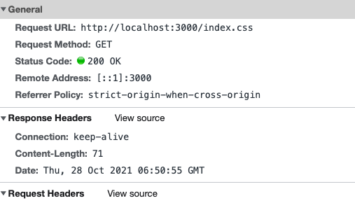

1. 执行文件
```bash
node server/xxx.js
```
2. 打开浏览器访问localhost:3000，并开启控制台查看请求资源响应头

# 实现http请求强制缓存&协商缓存

首先我们先看下请求静态资源的请求头信息，每次页面刷新都会向服务端发送请求。



```js
let server = http.createServer(async (req, res) => {
  console.log('=====', req.url) // /index.css 每次刷新都会进行打印
  //...
})
```
> 对一些实时性不高的静态文件进行缓存，防止重复请求服务器，造成服务器压力、渲染页面变慢等问题。


## 强制缓存&协商缓存

- 强制缓存：用户发送的请求，直接从用户客户端缓存读取，不发送到服务端，无与服务端交互
- 协商缓存：用户发送的请求，发送到服务端，由服务端根据参数判断是否让客户端从客户端缓存读取。协商缓存无法减少请求开销，但可减少返回的正文大小。


### 强制缓存

> 强制缓存就是不像服务端发请求

- [Cache-Control](https://developer.mozilla.org/zh-CN/docs/Web/HTTP/Headers/Cache-Control) 新版本
- [Expires](https://developer.mozilla.org/zh-CN/docs/Web/HTTP/Headers/Expires) 新版本


#### 实现强制缓存

在响应头中增加`Cache-Control`字段即可。

```js
let server  = http.createServer(async (req, res) => {
  let { pathname } = url.parse(req.url)
  let absPath = path.join(__dirname, '/public', pathname)
  try {
    let statObj = await fs.stat(absPath)
    if (statObj.isDirectory()) {
      absPath = path.join(absPath, 'index.html')
      await fs.access(absPath)
    }
    let content = await fs.readFile(absPath, 'utf-8')
    res.setHeader('Cache-Control', 'max-age=10')
    res.end(content)
  } catch (error) {
    res.end('Not found')
  }
})
```

第一次请求响应头携带`Cache-Control`字段值为`max-age=10`，说明该文件缓存10s


刷新后可以看到请求响应码`200(from memory cache)`，说明该文件从缓存中读取。缓存成功


> `Cache-Control`设置的值具体可以通过[文档](https://developer.mozilla.org/zh-CN/docs/Web/HTTP/Headers/Cache-Control)来查看

### 协商缓存

- [Last-Modified/If-Modified-Since](https://developer.mozilla.org/zh-CN/docs/Web/HTTP/Headers/Last-Modified)
- [Etag/If-None-Match](https://developer.mozilla.org/zh-CN/docs/Web/HTTP/Headers/ETag)

#### Last-Modified/If-Modified-Since

> Last-Modified 对比文件更新时间来缓存 

```js


```